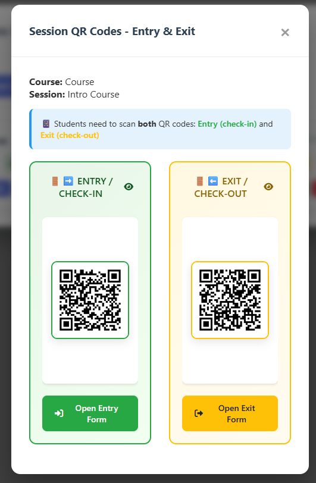
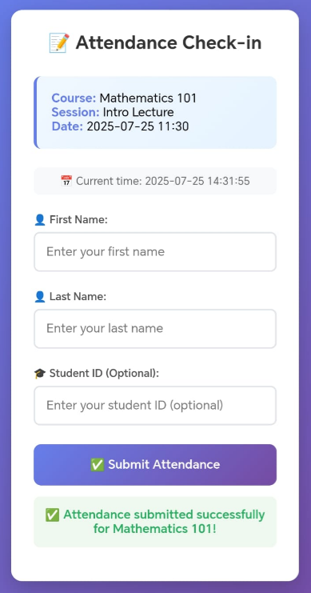
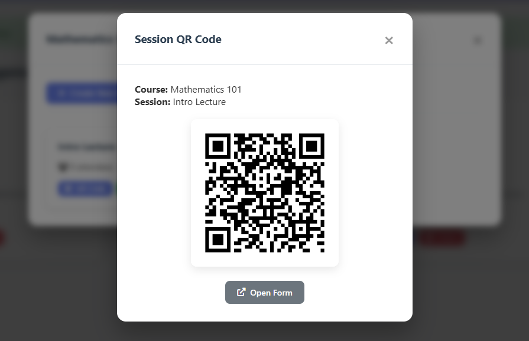
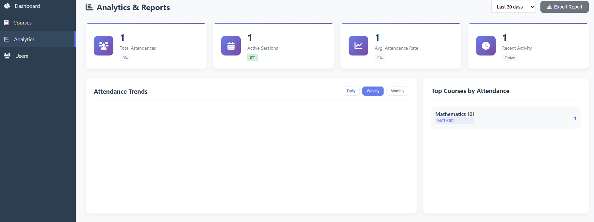

# 📱 QR Attendance System

A local QR code-based attendance tracking system built with Flask backend and HTML/CSS/JS frontend. The system runs entirely on your local network, requiring no cloud infrastructure.

## 🌟 Features

- **Dual QR Code System**: Entry and Exit QR codes for complete check-in/check-out tracking
- **QR Code Generation**: Automatically generates QR codes for attendance sessions
- **Local Network Access**: Works on LAN, accessible from mobile devices
- **Role-Based Access**: Admin, Instructor, and Participant roles
- **SQLite Database**: Lightweight, file-based database
- **CSV Export**: Export attendance data for analysis
- **Mobile Friendly**: Responsive design for mobile devices

## 🆕 Latest Updates (v2.1.0)

### 🚪 Entry & Exit QR Code System
- **Dual QR Codes**: Each session now generates separate Entry and Exit QR codes
- **Check-in/Check-out Tracking**: Students scan Entry QR to check-in and Exit QR to check-out
- **Enhanced Analytics**: Track entry time, exit time, and session duration
- **Improved UI**: Toggle visibility for Entry/Exit QR codes with show/hide functionality
- **Better Alignment**: Fixed QR code container overflow issues for perfect display
- **Visual Indicators**: Color-coded Entry (green) and Exit (yellow) sections for easy identification

<div align="center">
  
  <p><em>New dual QR code system with Entry/Exit functionality and toggle controls</em></p>
</div>

### 🎯 Benefits:
- More accurate attendance tracking with entry/exit times
- Better session management and duration tracking
- Enhanced user experience with intuitive QR code display
- Improved data collection for comprehensive analytics

## 📱 Application Screenshots

### 🔐 Login Interface
<div align="center">
  
  <p><em>Secure login interface for administrators and instructors</em></p>
</div>

### 📚 Course Management Dashboard
<div align="center">
  
  <p><em>Comprehensive course and session management interface</em></p>
</div>

### 📊 Attendance Tracking
<div align="center">
  
  <p><em>Real-time attendance monitoring and analytics</em></p>
</div>

### 📲 QR Code Display
<div align="center">
  
  <p><em>Dual QR code system with separate Entry and Exit codes, featuring toggle visibility controls and color-coded sections</em></p>
</div>

### 📈 Analytics Dashboard
<div align="center">
  
  <p><em>Comprehensive analytics and reporting interface with charts and insights</em></p>
</div>

## 📁 Project Structure

```
qr-attendance/
├── backend/
│   └── app.py              # Flask application
├── frontend/
│   ├── index.html          # Main interface
│   ├── style.css           # Styling
│   └── main.js             # Frontend logic
├── figures/                # Application screenshots
│   ├── sign in page.png    # Login interface
│   ├── course page.png     # Course management
│   ├── attandance.png      # Attendance tracking
│   ├── qr.png              # QR code display
│   └── analytics.png       # Analytics dashboard
├── instance/
│   └── attendance.db       # SQLite database
├── qr_codes/               # Generated QR code images
├── .env                    # Environment variables
├── requirements.txt        # Python dependencies
└── README.md              # This file
```

## 🚀 Quick Start

### 1. Prerequisites

- Python 3.7 or higher
- Windows/Linux/macOS
- Administrator privileges (for firewall configuration)

### 2. Installation

1. **Clone or download the project**
   ```bash
   git clone <repository-url>
   cd qr-attendance
   ```

2. **Create virtual environment**
   ```bash
   python -m venv venv
   ```

3. **Activate virtual environment**
   
   **Windows:**
   ```bash
   venv\Scripts\activate
   ```
   
   **Linux/macOS:**
   ```bash
   source venv/bin/activate
   ```

4. **Install dependencies**
   ```bash
   pip install -r requirements.txt
   ```

### 3. Configuration

1. **Create environment file**
   ```bash
   copy .env.example .env    # Windows
   cp .env.example .env      # Linux/macOS
   ```

2. **Find your local IP address**
   
   **Windows:**
   ```bash
   ipconfig
   ```
   Look for "IPv4 Address" under your network adapter (e.g., 192.168.1.5)
   
   **Linux/macOS:**
   ```bash
   ifconfig
   hostname -I
   ```

## 🔥 Firewall Configuration (Windows)

### ✅ Adding Firewall Rule via CMD

1. **Open Command Prompt as Administrator**
   - Press `Win + R`, type `cmd`
   - Right-click → "Run as administrator"

2. **Add firewall rule**
   ```bash
   netsh advfirewall firewall add rule name="FlaskLocal" dir=in action=allow protocol=TCP localport=5000
   ```

### Command Explanation:
- `name="FlaskLocal"`: Rule name
- `dir=in`: For incoming connections
- `action=allow`: Allow the connection
- `protocol=TCP`: TCP protocol
- `localport=5000`: Port 5000

### 🔄 Remove Firewall Rule (if needed)
```bash
netsh advfirewall firewall delete rule name="FlaskLocal"
```

### 🔍 Verify Firewall Rule
```bash
netsh advfirewall firewall show rule name="FlaskLocal"
```

## 🏃‍♂️ Running the Application

1. **Start the Flask server**
   ```bash
   cd backend
   python app.py
   ```

2. **Access the application**
   - **Local access**: http://localhost:5000
   - **Network access**: http://YOUR_IP:5000 (e.g., http://192.168.1.5:5000)

3. **Test mobile access**
   - Connect your mobile device to the same Wi-Fi network
   - Open browser and navigate to http://YOUR_IP:5000

## 👥 User Roles & Usage

### 🔐 Admin Dashboard
- **URL**: `/admin`
- **Access**: Full system control
- **Features**:
  - Create courses and sessions
  - Manage users
  - View all attendance data
  - Export CSV reports

### 👨‍🏫 Instructor Panel
- **URL**: `/instructor`
- **Access**: Own courses only
- **Features**:
  - Create attendance sessions
  - Generate QR codes
  - View attendance for own courses
  - Export attendance data

### 📱 Student/Participant Access
- **URL**: `/attend/entry/<token>` or `/attend/exit/<token>` (via QR code)
- **Access**: Public form
- **Features**:
  - Scan Entry QR code to check-in at session start
  - Scan Exit QR code to check-out at session end
  - Fill attendance form (Name, Surname, Student ID)
  - Submit attendance with timestamp tracking

## 📊 Creating Attendance Session

1. Login as Admin or Instructor
2. Navigate to "Sessions" section
3. Click "Create New Session"
4. Fill session details:
   - Course selection
   - Session title
   - Date and time
5. Click "Generate QR Code"
6. Dual QR codes (Entry & Exit) will be generated and saved in `/qr_codes/` folder
7. Display QR codes for students:
   - **Entry QR**: Students scan to check-in (start of session)
   - **Exit QR**: Students scan to check-out (end of session)
8. Use toggle controls to show/hide specific QR codes as needed

## 📤 Exporting Data

1. Navigate to the session you want to export
2. Click "Export CSV" button
3. File will download with attendance data including:
   - Student names
   - Entry time (check-in)
   - Exit time (check-out)
   - Session duration
   - IP addresses
   - Session details

## 🔧 Troubleshooting

### Cannot Access from Mobile Device

1. **Check firewall rule is active**
   ```bash
   netsh advfirewall firewall show rule name="FlaskLocal"
   ```

2. **Verify Flask is running on correct host**
   - Ensure Flask runs with `host="0.0.0.0"`
   - Check console output shows: `Running on all addresses (0.0.0.0)`

3. **Check network connectivity**
   ```bash
   ping YOUR_IP
   ```

4. **Verify same network**
   - Ensure both devices are on same Wi-Fi network
   - Check if network allows device-to-device communication

### Database Issues

1. **Reset database**
   ```bash
   rm instance/attendance.db
   python backend/app.py  # Will recreate database
   ```

2. **Check database permissions**
   - Ensure write permissions for `/instance/` folder

### QR Code Generation Problems

1. **Check QR codes folder**
   ```bash
   mkdir qr_codes  # Create if missing
   ```

2. **Verify PIL/Pillow installation**
   ```bash
   pip install Pillow qrcode
   ```

## 🛡️ Security Notes

- **Local Network Only**: System is designed for local network use
- **No Authentication Required**: Participants can attend without login
- **IP Tracking**: System tracks IP addresses for duplicate prevention
- **Admin Access**: Secure admin credentials for system management

## 📋 Dependencies

- **Flask**: Web framework
- **SQLite**: Database
- **qrcode**: QR code generation
- **Pillow**: Image processing
- **Additional**: See `requirements.txt` for complete list

## 🆘 Support

### Common Commands

**Check if port is in use:**
```bash
netstat -an | findstr :5000
```

**Kill process on port 5000:**
```bash
# Find process
netstat -ano | findstr :5000
# Kill process (replace PID)
taskkill /PID <PID> /F
```

**Restart Flask with debug:**
```bash
set FLASK_DEBUG=1
python app.py
```

## 📝 License

This project is licensed under the MIT License - see the [LICENSE](LICENSE) file for details.

Feel free to use, modify, and distribute this project according to the MIT License terms.

---

**📧 Need Help?** Check the troubleshooting section above or review the Flask console output for error messages. 